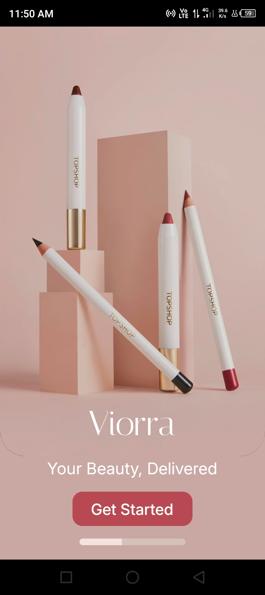
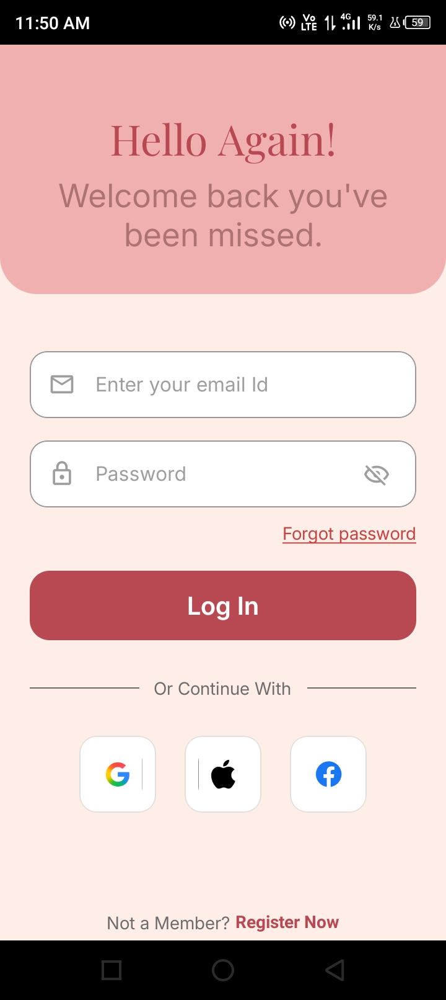
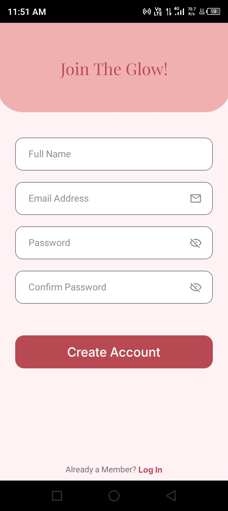
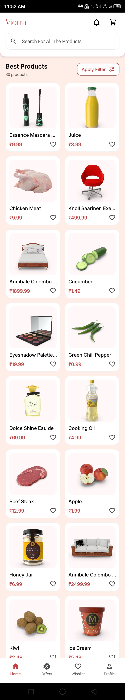
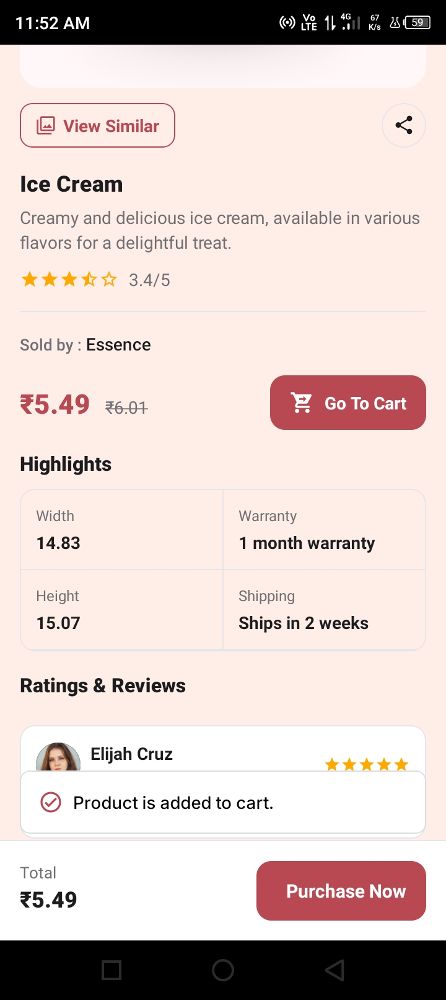
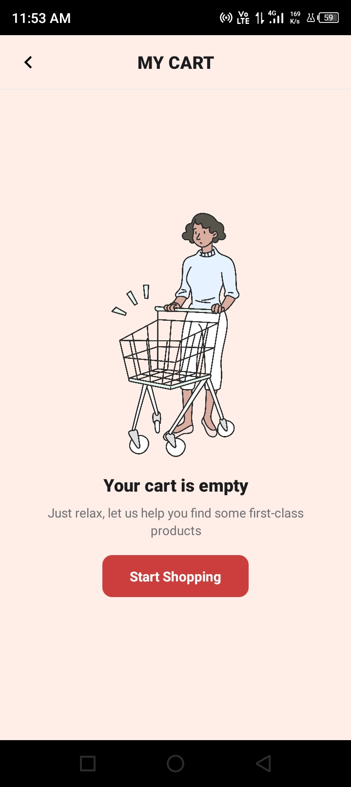
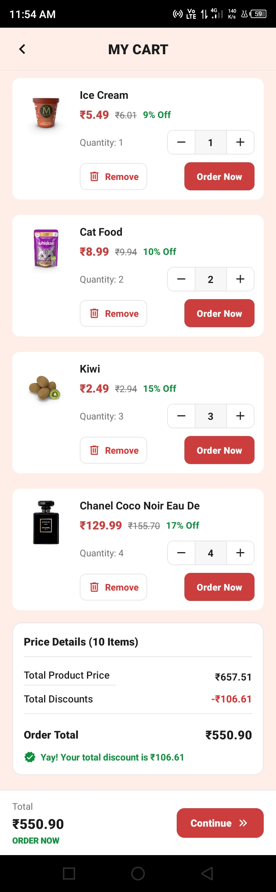
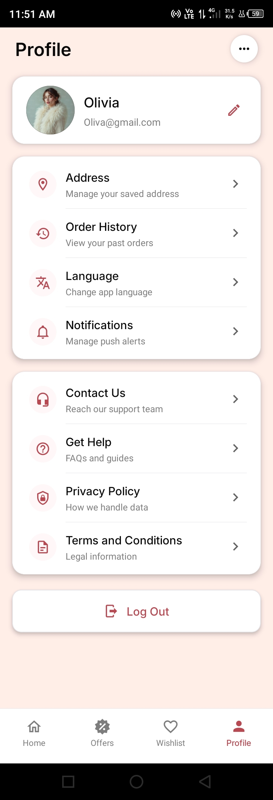

# GlowCart — Beauty E-Commerce Mobile App (React Native CLI)

- GlowCart is a beauty e-commerce mobile application built with React Native (React Native CLI).  
- This repository includes the source code, assets, and a release APK that runs without Metro (bundled JS).

---

## 🔎 Quick summary
- **Platform:** Android (React Native CLI)  
- **API used:** `https://dummyjson.com/products`  
- **Screens implemented:** Onboarding, Login, Register (UI-only), Product List, Product Details, Cart, Profile  
- **Note:** Login/Register are UI only (no backend authentication).  
- **Release APK:** Built with embedded JS bundle — app runs without Metro / USB debugging.

---

## ✅ Features implemented
- Onboarding flow (UI)  
- Login & Register screens (UI only)  
- Product listing from public API  
- Product details screen  
- Add to cart / remove from cart / quantity control  
- Cart total calculation and cart UI  
- Profile screen (UI)  
- App icon (1024×1024)  
- Release APK build (standalone, bundled JS)

---

## 📁 Repo structure (important paths)
/GlowCart
/android ← native Android project
/ios ← iOS (not used for this assignment)
/assets ← images, icons, fonts used by the app
/docs
/screenshots ← screenshots (visible in README)
/video ← demo_full_recording.mp4 (also shared via Drive)
App.js
index.js
package.json
README.md

yaml
Copy code

---

## 📸 Screenshots & demo
Screenshots are included in the repository:
- 
- 
- 
- 
- 
- 
- 
- 
-   

**Demo video (recording):**

- Stream / download link (Google Drive) : [▶ Watch Demo Video](https://drive.google.com/drive/folders/1XaG1XTV65pPpwhR3wuI0P9s-0-8Yi2_q?usp=sharing)
- Local file: `docs/video/demo_full_recording.mp4`

> Tip: If you want a client to play the video directly in the README, upload the video to YouTube as *Unlisted* and paste the YouTube link here.

---

## 🧰 Prerequisites (what to install on the machine)
- Node.js (v16 or v18 recommended) — check with `node -v`  
- npm (comes with Node) — check `npm -v`  
- Java JDK (11 or 17) — check `java -version`  
- Android SDK & platform tools (Android Studio recommended)  
- ANDROID_HOME environment variable set to your SDK path.  
- Enable **USB debugging** on the Android device for dev testing.

---

## 🛠️ How to run (development)
> Use these commands while developing (requires Android SDK, JDK & device/emulator).

1. Install dependencies:

```bash
npm install
```

2. Start Metro in one terminal:

```bash
npx react-native start
```

3. In another terminal run on connected Android device/emulator:

```bash
npx react-native run-android
```

4. 📦 How to build a release APK (what we used)

- (Exact commands used to embed the JS bundle and produce a standalone APK)

- Create Android assets folder (Windows PowerShell — run from project root if folder missing):

```bash
New-Item -ItemType Directory -Force -Path android\app\src\main\assets
```

5. Generate JS bundle and copy assets into Android resources:

```bash
npx react-native bundle --platform android --dev false --entry-file index.js --bundle-output android/app/src/main/assets/index.android.bundle --assets-dest android/app/src/main/res/
```

6. Build the release APK (Windows PowerShell inside android folder):

```bash
cd android
.\gradlew assembleRelease
```

7. Resulting APK path:

```bash
android/app/build/outputs/apk/release/app-release.apk
```

- We renamed the generated APK to GlowCart.apk for easier sharing. When sharing directly from a device, Android may name the file base.apk — this is normal. For client delivery share the GlowCart.apk from the PC build folder or attach it to a GitHub Release.

## ⚠️ Known issues / notes

- A 0–1s blank/default background may appear before the onboarding screen on some devices — this is system default while JS initializes
- It does not affect functionality. (If needed we can add a native branded splash screen.)

- Onboarding/Login/Register are UI-only (no backend).

- If you modify the UI, test in dev mode (USB debugging) then regenerate bundle and APK before sharing.

## 📦 What to include when delivering to client
- Push the latest code (with README and /docs) to GitHub.

- Provide the GlowCart.apk found at android/app/build/outputs/apk/release/ (or attach APK to GitHub Release).

- Provide demo video (Drive or YouTube) and screenshots (already in docs/screenshots).

- Add a short note: Onboarding/Login/Register = UI only.

## 🔁 How to rebuild after changes

- Make code changes.

- Test in dev:

```bash
npx react-native start
npx react-native run-android
```

- When ready to create a new release APK, repeat the bundle + assembleRelease steps shown above.

## 👨‍💻 Author / Contact
- Project prepared from supplied Figma designs & public API.